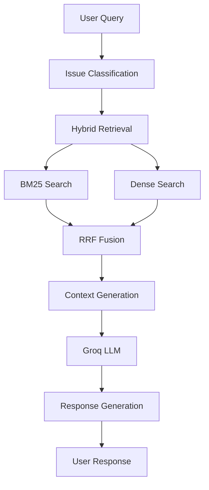

# README.md
# Technical Support Chat Agent with Groq and Hybrid Retrieval

An advanced AI-powered technical support assistant using Groq's LPU for fast inference and hybrid retrieval (BM25 + Dense Embeddings) for accurate knowledge base search.

## Features

- **Groq LPU Integration**: Ultra-fast response generation using Groq's Language Processing Units
- **Hybrid Retrieval**: Combines BM25 (sparse) and dense embeddings for optimal search results
- **Reciprocal Rank Fusion (RRF)**: Intelligently merges results from multiple retrieval methods
- **Comprehensive Knowledge Base**: Pre-loaded with technical documentation from:
  - Microsoft Documentation
  - Stack Overflow solutions
  - IT best practices
  - Hardware troubleshooting guides
- **Multiple Interfaces**: CLI and web (Streamlit) interfaces
- **Real-time Analytics**: Track query categories, response times, and KB usage

## Quick Start

### 1. Get Groq API Key

1. Visit [Groq Console](https://console.groq.com/keys)
2. Sign up or log in
3. Create a new API key
4. Copy the key (starts with `gsk_`)

### 2. Installation

```bash
# Clone the repository
git clone <repository-url>
cd tech-support-agent

# Run setup script
chmod +x setup.sh
./setup.sh

# Or manually:
python -m venv venv
source venv/bin/activate  # Windows: venv\Scripts\activate
pip install -r requirements.txt
```

### 3. Configuration

Edit `.env` file:
```env
GROQ_API_KEY=gsk_your_api_key_here
DEFAULT_MODEL=mixtral-8x7b-32768
```

### 4. Run the Application

**CLI Interface:**
```bash
python tech_support_agent.py
```

**Web Interface:**
```bash
streamlit run streamlit_app.py
```

**Docker:**
```bash
docker-compose up
```

## Available Models

- **mixtral-8x7b-32768**: Best overall performance, 32k context window (recommended)
- **llama2-70b-4096**: Powerful open model, 4k context
- **gemma-7b-it**: Fast and efficient for quick responses

## Architecture

### Hybrid Retrieval System

The system uses a sophisticated hybrid retrieval approach:

1. **BM25 (Sparse Retrieval)**: 
   - Keyword-based matching
   - Effective for exact term matches
   - Fast and interpretable

2. **Dense Embeddings (Semantic Search)**:
   - Uses sentence-transformers for encoding
   - FAISS for efficient similarity search
   - Captures semantic meaning

3. **Reciprocal Rank Fusion (RRF)**:
   - Combines rankings from both methods
   - Formula: `score = Σ(1 / (α + rank))`
   - Configurable α parameter for rank weighting

### Knowledge Base Sources

- **Microsoft Documentation**: Windows troubleshooting, system configuration
- **Stack Overflow**: Community-driven solutions
- **IT Best Practices**: Industry-standard procedures
- **Hardware Guides**: Manufacturer documentation

## Project Structure

```
tech-support-agent/
├── tech_support_agent.py    # Main agent implementation
├── streamlit_app.py         # Web interface
├── requirements.txt         # Python dependencies
├── .env.example            # Environment variables template
├── setup.sh                # Setup script
├── Dockerfile              # Docker configuration
├── docker-compose.yml      # Docker Compose setup
├── data/                   # Data storage
├── kb_index/              # Knowledge base index files
└── logs/                  # Application logs
```

## API Usage

```python
from tech_support_agent import TechSupportAgent

# Initialize agent
agent = TechSupportAgent(
    groq_api_key="your_api_key",
    model_name="mixtral-8x7b-32768"
)

# Generate response
result = agent.generate_response("My Wi-Fi keeps disconnecting")
print(result["response"])
print(f"Category: {result['category']}")
print(f"Using KB: {result['has_context']}")
```

## Performance Optimization

- **Index Caching**: Save and load pre-built indices
- **Batch Processing**: Process multiple queries efficiently
- **GPU Acceleration**: Use `faiss-gpu` for faster dense retrieval
- **Model Quantization**: Use smaller models for edge deployment

## Troubleshooting

### Common Issues

1. **Groq API Key Error**
   - Ensure key starts with `gsk_`
   - Check for trailing spaces
   - Verify key is active in Groq console

2. **Memory Issues**
   - Reduce embedding batch size
   - Use smaller embedding model
   - Limit conversation history

3. **Slow Response Times**
   - Check internet connection
   - Try a different Groq model
   - Reduce number of retrieved documents

## Contributing

Contributions are welcome! Please:
1. Fork the repository
2. Create a feature branch
3. Commit your changes
4. Push to the branch
5. Open a Pull Request

## License

MIT License - see LICENSE file for details

## Acknowledgments

- Groq for LPU technology
- Sentence Transformers for embeddings
- FAISS for vector search
- BM25 for sparse retrieval

---

# ARCHITECTURE.md
# Technical Support Agent - Architecture Documentation

## System Overview

The Technical Support Agent is a sophisticated AI-powered support system that combines multiple retrieval techniques with Groq's fast inference capabilities to provide accurate technical assistance.

## Core Components

### 1. Knowledge Base Builder

**Purpose**: Aggregates technical documentation from multiple sources

**Sources**:
- Microsoft Documentation (Windows troubleshooting)
- Stack Overflow (Community solutions)
- IT Best Practices (Industry standards)
- Hardware Documentation (Manufacturer guides)

**Data Structure**:
```python
@dataclass
class Document:
    id: str
    title: str
    content: str
    category: str
    keywords: List[str]
    solutions: List[str]
    metadata: Dict[str, Any]
```

### 2. Hybrid Retriever

**Components**:

#### BM25 (Sparse Retrieval)
- **Algorithm**: Okapi BM25
- **Strengths**: Exact keyword matching, interpretability
- **Use Case**: Finding documents with specific technical terms

#### Dense Retrieval
- **Model**: Sentence-BERT (all-MiniLM-L6-v2)
- **Index**: FAISS (Facebook AI Similarity Search)
- **Strengths**: Semantic understanding, context awareness
- **Use Case**: Finding conceptually similar solutions

#### Reciprocal Rank Fusion (RRF)
- **Formula**: `score(d) = Σ 1/(k + rank(d))`
- **Parameters**: 
  - k (alpha): Controls rank importance (default: 60)
  - Higher k: More weight on top-ranked documents
  - Lower k: More uniform weight distribution

### 3. Groq Integration

**Models Available**:
- Mixtral 8x7B (32k context) - Recommended
- Llama 2 70B (4k context)
- Gemma 7B IT

**API Configuration**:
```python
client = Groq(api_key=groq_api_key)
completion = client.chat.completions.create(
    model=model_name,
    messages=messages,
    temperature=0.3,  # Lower for consistency
    max_tokens=1000
)
```

### 4. Conversation Management

**Features**:
- Context window management (last 8 messages)
- Category classification
- Response metadata tracking
- Conversation export/import

## Data Flow



## Retrieval Pipeline

### 1. Query Processing
```python
# Tokenization for BM25
tokens = query.lower().split()

# Embedding for dense search
embedding = model.encode(query)
```

### 2. Parallel Search
- BM25: Token-based scoring
- Dense: Cosine similarity in embedding space

### 3. Rank Fusion
```python
for rank, (idx, _) in enumerate(bm25_results):
    rrf_scores[idx] += 1.0 / (alpha + rank + 1)
    
for rank, (idx, _) in enumerate(dense_results):
    rrf_scores[idx] += 1.0 / (alpha + rank + 1)
```

### 4. Context Assembly
- Top-k documents selected
- Formatted with title, category, and solutions
- Passed to LLM with user query

## Performance Considerations

### Indexing
- **Initial Build**: ~30 seconds for 100+ documents
- **Search Time**: <100ms for hybrid search
- **Memory Usage**: ~500MB for embeddings + index

### Optimization Strategies
1. **Index Persistence**: Save/load pre-built indices
2. **Batch Processing**: Process multiple embeddings together
3. **Caching**: Store frequently accessed documents
4. **Quantization**: Reduce embedding precision for memory savings

## Deployment Options

### 1. Local Deployment
```bash
python tech_support_agent.py  # CLI
streamlit run streamlit_app.py  # Web
```

### 2. Docker Deployment
```bash
docker-compose up
```

### 3. Cloud Deployment
- **Recommended**: AWS EC2, Google Cloud Run, Azure Container Instances
- **Requirements**: 2GB RAM minimum, 4GB recommended
- **Scaling**: Horizontal scaling with load balancer

## Security Considerations

1. **API Key Management**: Use environment variables
2. **Data Privacy**: No user data persistence by default
3. **Rate Limiting**: Implement for production
4. **Input Validation**: Sanitize user queries
5. **HTTPS**: Use for web deployment

## Future Enhancements

1. **Multi-language Support**: Add translation layer
2. **Feedback Loop**: Learn from user interactions
3. **Custom Knowledge Base**: Allow user-uploaded documents
4. **Voice Interface**: Add speech-to-text/text-to-speech
5. **Advanced Analytics**: Track resolution rates
6. **Integration APIs**: Connect with ticketing systems

## Monitoring & Logging

### Metrics to Track
- Query volume and categories
- Response times (P50, P95, P99)
- Knowledge base hit rate
- Model token usage
- Error rates

### Logging Strategy
```python
import logging

logging.basicConfig(
    level=logging.INFO,
    format='%(asctime)s - %(name)s - %(levelname)s - %(message)s',
    handlers=[
        logging.FileHandler('logs/agent.log'),
        logging.StreamHandler()
    ]
)
```

## Best Practices

1. **Regular KB Updates**: Refresh knowledge base monthly
2. **Model Selection**: Choose based on latency/quality tradeoff
3. **Context Length**: Monitor and trim when necessary
4. **Error Handling**: Graceful degradation with fallbacks
5. **Testing**: Unit tests for retrieval, integration tests for full pipeline
